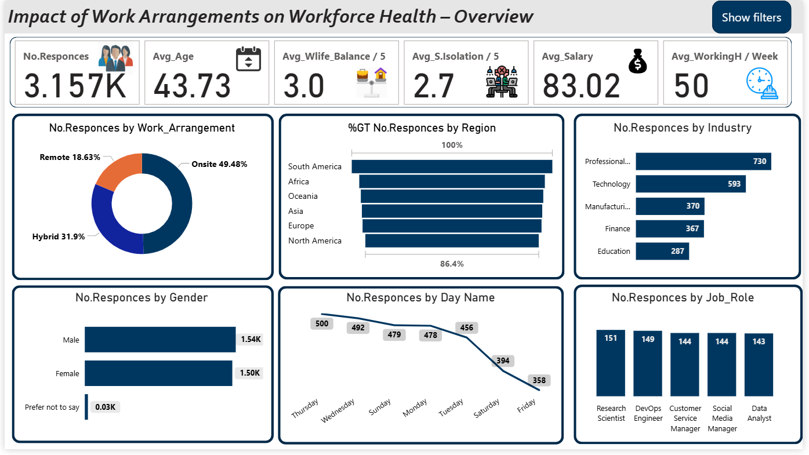

# IEEE-2025-Final-Project-Impact of Work on Employees Health
This repository showcases the final project for the IEEE 2025 season,  
*submitted by `Khaled Ramadan, Head of Committee`.*

---

## 🔎 Quick Navigation
- [📊 Power BI Analysis: Project Overview](#-power-bi-analysis-project-overview)  
- [📂 Remote Work Health Impact 2025 Dataset](#-remote-work-health-impact-2025-dataset)  
- [❓ Research Questions](#-research-questions)  
- [📊 Overview of Survey Responses](#-overview-of-survey-responses)  
- [🔑 Key Findings](#-key-findings)  
- [🚀 Implications for Stakeholders](#-implications-for-stakeholders)  
- 📖 [A Guide to Employee Well-being: Addressing Common Health Concerns](#a-guide-to-employee-well-being-addressing-common-health-concerns)
---

# 📊 Power BI Analysis: Project Overview
This Power BI project analyzes the health impacts of different work arrangements (Remote, Hybrid, Onsite).  
The analysis is based on a 2025 survey dataset covering employee demographics, work habits, and self-reported health metrics.

### The interactive dashboard explores key connections between work arrangement and:
- Mental Health Status (Anxiety, Burnout, Stress)  
- Physical Health Issues (Back Pain, Eye Strain, etc.)  
- Work-Life Balance & Social Isolation  
- Trends across different industries, job roles, and regions  

**Objective:** To visualize how remote and hybrid work models correlate with employee well-being and identify key trends for a healthier, more productive workforce.  

---

# 📂 Remote Work Health Impact 2025 Dataset
This dataset contains survey responses on the impact of different work arrangements on employee health and well-being.  
The data was collected in 2025 and includes information on mental and physical health, work-life balance, and other relevant factors.  

## Dataset Description
The dataset is in CSV format and contains the following columns:

- `Survey_Date`: Date the survey was taken  
- `Age`: Age of respondent (22–65)  
- `Gender`: Female, Male, Non-binary, Prefer not to say  
- `Region`: Asia, Africa, Europe, South America, Oceania, North America  
- `Industry`: Professional Services, Education, Manufacturing, Customer Service, Technology, Finance, Retail, Healthcare, Marketing  
- `Job_Role`: Data Analyst, Business Analyst, DevOps Engineer, IT Support, etc.  
- `Work_Arrangement`: Onsite, Hybrid, Remote  
- `Hours_Per_Week`: 35–65  
- `Mental_Health_Status`: Stress Disorder, ADHD, None, Burnout, Anxiety, PTSD, Depression  
- `Burnout_Level`: High, Medium, Low  
- `Work_Life_Balance_Score`: 1–5  
- `Physical_Health_Issues`: Back Pain, Shoulder Pain, Eye Strain, Neck Pain, Wrist Pain, None  
- `Social_Isolation_Score`: 1–5  
- `Salary_Range`: $40K–60K, $60K–80K, $80K–100K, $100K–120K, $120K+  

---

# ❓ Research Questions

This project explores the following key questions based on the survey dataset:

## 📊 Overview
- How many responses were collected in the survey?  
- What are the average ratings for **work–life balance** and **social isolation**?  
- Which regions/continents had the highest participation?  
- Which days are most effective for conducting surveys?  
- What are the most common **job roles** and **industries** represented?  
- What is the most common type of **work arrangement** (Onsite, Hybrid, Remote)?  
- What is the **gender distribution** of survey participants?  

---

## 🏢 Jobs & Industries
- What percentage of employees report **physical**, **mental**, or **burnout-related (High)** health issues?  
- Which are the **top 5 jobs** with the highest levels of **mental health problems**?  
- Which are the **top 5 jobs** with the highest levels of **physical health problems**?  
- Which industries show the **highest burnout rates**?  
- How do **mental vs. physical health issues** compare across industries?  

---

## 👩‍💻 Gender & Health
- Which gender reports higher levels of **physical** and **mental health issues**?  
- How does the **work–life balance score** differ between genders?  
- Which gender shows **better work–life balance** and **lower social isolation**?  

---

## 🌍 Regional Insights
- Which continent has the **highest average work–life balance**?  
- Which has the **lowest average social isolation**?  
- Which region shows the **lowest burnout levels**?  
- Which regions have the **lowest rates of mental and physical health problems**?  

---

## 🧠 Health Conditions
- What are the **top three most common physical health issues**?  
- What are the **top three most common mental health issues**?  

---

## 🏠 Work Mode Analysis
- How does **work mode** (Onsite, Hybrid, Remote) relate to **work–life balance** and **social isolation**?  
- Which work mode shows the **highest balance** and **lowest isolation**?  
- What is the overall **distribution of burnout levels**?  
- Which work mode has the **highest burnout levels**?  

---

# 📊 Overview of Survey Responses

### General Statistics
- **Total responses:** 3,157  
- **Average work-life balance:** 3.0 / 5  
- **Average social isolation:** 2.7 / 5  
- **Average working hours per week:** 50 hours  

### Highest Participation By
- **Continent:** South America  
- **Industry:** Professional Services, Technology  
- **Job Roles:** Research Scientists, DevOps Engineers  
- **Work Mode:** Onsite  
- **Gender:** Male  
- **Best Survey Days:** Thursday, Wednesday, Sunday  

---

# 🔑 Key Findings

## 1. General Health Insights
- **Mental health issues reported:** 74.7%  
- **Physical health issues reported:** 91.1%  
- **High burnout:** 33%  

**Most common physical issues:** Back pain (54.3%), Shoulder pain (26%), Eye strain (13.9%)  
**Most common mental issues:** PTSD (17.9%), Anxiety (16.7%), Burnout (16.6%)  

---

## 2. Job Role Insights
- **Highest mental health issues:** QA (81%), Consultants (80%), Product Managers (79.7%), HR Managers (77.3%), IT Support (77.1%).  
- **Highest physical health issues:** Research Scientists (92.1%), DevOps Engineers (91.3%), Customer Service Managers (91%), Data Analysts (90.9%), Social Media Managers (88.9%).  

---

## 3. Industry Insights
- **High burnout:** Technology (39%), Marketing (35.6%), Healthcare (34.4%).  
- **High physical health problems:** Education (94.1%).  
- **High mental health problems:** Customer Services (77.5%).  
- **Lower reported issues:** Retail (lowest physical), Education (lowest mental).  

---

## 4. Gender Insights
- **Physical health problems:** Females (91.4%) vs Males (91%).  
- **Mental health problems:** Females (75.7%) vs Males (74%).  
- **Work-life balance:** Females (3.01) vs Males (2.9).  
- **Social isolation:** Males (2.73) vs Females (2.68).  

---

## 5. Regional Insights
- **Physical health issues:** Highest in Europe (92%), lowest in Oceania (90%).  
- **Mental health issues:** Highest in Africa (78%), lowest in Oceania (72%).  
- **High burnout:** Highest in South America (35%), lowest in Africa (31%).  
- **Work-life balance:** Highest in Asia (3.23), lowest in South America (2.81).  
- **Social isolation:** Highest in Africa (2.74), lowest in Europe (2.65).  

---

## 6. Work Mode Insights
- **Most common burnout level:** Medium (43%).  
- **Highest burnout by mode:** Remote (46% report high burnout).  
- **Work-life balance:** Highest onsite (3.03), lowest hybrid (2.95).  
- **Social isolation:** Highest remote (3.5), lowest onsite (2.38).  

---
## A Guide to Employee Well-being: Addressing Common Health Concerns

This guide provides practical advice for managing the common mental and physical health issues often identified in our analysis and faced in the modern workplace.

### 1. Managing Mental Health Challenges
*(PTSD, Anxiety, Burnout, Depression, ADHD)*

* **Seek Professional Support:** Consulting a therapist or mental health professional is a sign of strength. Check if your company offers an Employee Assistance Program (EAP) for confidential, often free, support.

* **Set Clear Boundaries:** Establish a hard stop to your workday. Disconnecting fully by turning off notifications is essential for mental recovery and preventing burnout.

* **Communicate Effectively:** If you feel comfortable, speak with your manager or HR about your workload or specific stressors. A solution may be as simple as adjusting tasks, shifting deadlines, or clarifying expectations.

* **Practice Mindfulness & Organization:**
    * Take short, regular breaks throughout the day to clear your mind.
    * Use organizational tools like calendars, to-do lists, or project management apps to manage tasks and reduce the feeling of being overwhelmed.

### 2. Mitigating Physical Health Problems
*(Back, Shoulder, Neck, Wrist Pain & Eye Strain)*

* **Optimize Your Workspace Ergonomics:**
    * **Posture:** Adjust your chair so your feet are flat on the floor and your lower back is supported. Your knees should be at about a 90-degree angle.
    * **Monitor:** Position your screen directly in front of you, at or just below eye level, to keep your neck in a neutral, relaxed position.
    * **Wrists:** Ensure your wrists remain straight and neutral when typing. Consider an ergonomic keyboard and mouse for better support.

* **Incorporate Regular Movement:**
    * Stand up, stretch, and walk around for a few minutes every hour to relieve muscle tension and improve circulation.
    * **For Eye Strain (The 20-20-20 Rule):** Every 20 minutes, take a 20-second break to look at something 20 feet (about 6 meters) away. This helps reduce digital eye strain.

* **Consult a Professional:** Do not ignore chronic pain. If discomfort persists, see a doctor or a physical therapist for an accurate diagnosis and a personalized treatment plan.

---

### Conclusion

Proactively managing your mental and physical health is a critical investment in your long-term well-being and professional success. Use the insights from the data to inform your habits and advocate for a healthier work environment.
---

# 🚀 Implications for Stakeholders
- **Workload & Hours:** Employees average 50 hours per week → contributes to high physical and mental health issues. Reducing hours and promoting breaks is critical.  
- **Targeted Support:** Certain roles (QA, Consultants, Research Scientists, DevOps) and industries (Technology, Education, Healthcare) need tailored wellness programs.  
- **Gender Considerations:** Women report more health issues but better balance; men report more isolation → initiatives should address both.  
- **Remote Work Challenges:** Remote work offers flexibility but leads to higher burnout and isolation → more support and social connection opportunities are needed.  
- **Regional Differences:** Asia and Oceania show better scores; Africa and South America need focused intervention strategies.  
